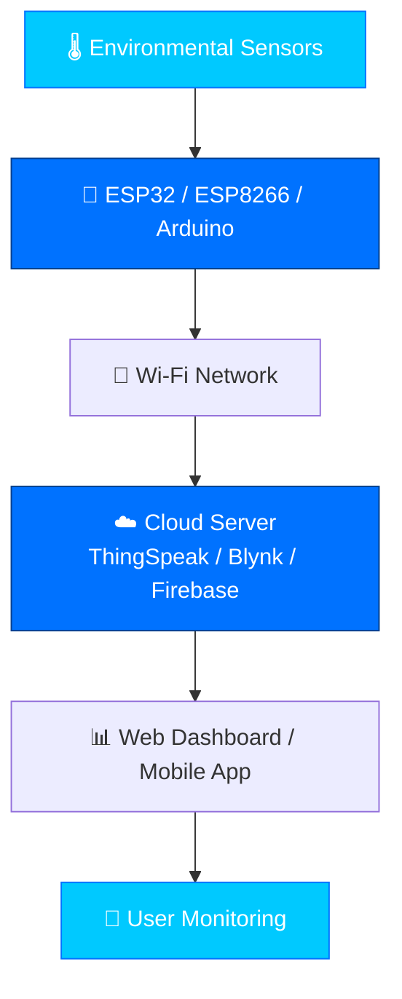
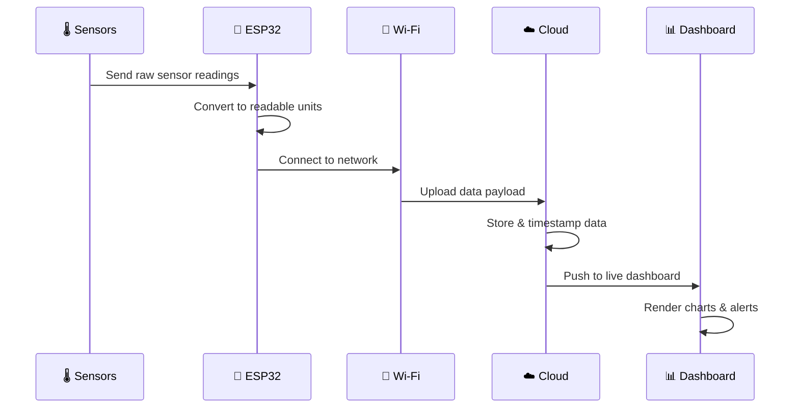
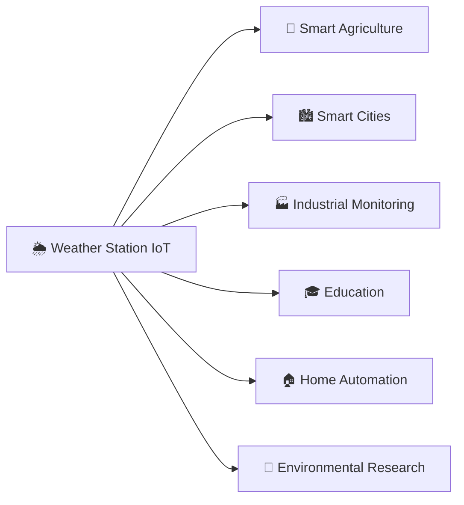

<div align="center">


<br/>


</div>

<br/>

## 📑 Table of Contents

- [🌍 Introduction](#-introduction)
- [🎯 Objective](#-objective)
- [⚙️ Working Principle](#️-working-principle)
- [🏗️ System Architecture](#️-system-architecture)
- [🔄 Data Flow](#-data-flow)
- [🔌 Hardware Components](#-hardware-components)
- [💻 Software & Tools](#-software--tools)
- [✨ Features](#-features)
- [🌐 Applications](#-applications)
- [📊 Advantages vs Limitations](#-advantages-vs-limitations)
- [🚀 Future Enhancements](#-future-enhancements)
- [🏁 Conclusion](#-conclusion)
- [📜 License](#-license)

---

## 🌍 Introduction

> A **Weather Station IoT Project** is an embedded systems application that collects environmental data using sensors and streams it live to the internet for real-time monitoring.

Unlike traditional weather stations that log data locally, this system continuously pushes live readings to the cloud — letting you check the weather from your phone, laptop, or a custom dashboard, from anywhere in the world. 🌎

It's a perfect blend of:

🔧 Electronics &nbsp;|&nbsp; 📡 Wireless Communication &nbsp;|&nbsp; ☁️ Cloud Platforms &nbsp;|&nbsp; 🖥️ Web Dashboards

**Used in:** Agriculture 🌾 · Smart Cities 🏙️ · Industry 🏭 · Research Labs 🔬 · Education 🎓 · Home Automation 🏠

---

## 🎯 Objective

Build an **IoT-based smart weather monitoring system** that:

- 📡 Measures environmental conditions in real time
- ☁️ Makes data accessible remotely via the internet
- 🤖 Operates with minimal human intervention
- 📈 Stores historical data for trend analysis and smarter decisions

---

## ⚙️ Working Principle

```
Sensors read live values  →  ESP32 converts to readable units  →
Local display (optional)  →  Data pushed to cloud over Wi-Fi  →
Dashboard renders charts  →  User checks weather, anytime, anywhere
```

The microcontroller polls each sensor at a fixed interval, converts raw readings into real-world units (°C, %, hPa), optionally shows them on a local OLED/LCD, then publishes the payload to the cloud — where it's stored, charted, and served to any connected device. 📲

---

## 🏗️ System Architecture



---

## 🔄 Data Flow



---

## 🔌 Hardware Components

| # | Component | Measures | Why It's Used |
|---|-----------|----------|----------------|
| 1️⃣ | **ESP32** | — (controller) | Dual-core, built-in Wi-Fi + Bluetooth, plenty of GPIOs |
| 2️⃣ | **DHT22** | Temperature 🌡️ & Humidity 💧 | More accurate & stable than DHT11 |
| 3️⃣ | **BMP280** | Pressure, Temp, Altitude 🏔️ | Useful for forecasting & elevation |
| 4️⃣ | **Rain Sensor** | Rainfall 🌧️ | Detects droplets, can trigger irrigation |
| 5️⃣ | **LDR** | Light Intensity ☀️ | Tracks daylight, automates lighting |
| 6️⃣ | **MQ135** | Air Quality 🍃 | Detects CO₂, ammonia, smoke, benzene |
| 7️⃣ | **OLED Display** | Local readout 📺 | Shows live data without internet |

---

## 💻 Software & Tools

<p>
  
  
  
  
</p>
<p>
  
  
  
  
  
</p>

---

## ✨ Features

- ⚡ Real-time weather monitoring
- 📡 Wireless data transmission
- 🌍 Remote monitoring from anywhere
- 📈 Live graphical visualization
- 🗄️ Historical data storage & cloud analytics
- 🔋 Low power consumption
- 🧩 Expandable sensor support
- 🔔 Mobile notifications & alerts
- 🏠 Easy integration with smart home systems

---

## 🌐 Applications



| Sector | Use Case |
|--------|----------|
| 🌾 **Agriculture** | Optimize irrigation & protect crops |
| 🏙️ **Smart Cities** | Monitor pollution & manage infrastructure |
| 🏭 **Industry** | Maintain safe temperature/humidity for equipment |
| 🎓 **Education** | Hands-on IoT, embedded systems & cloud learning |
| 🏠 **Home Automation** | Auto-control fans, AC, lighting, irrigation |
| 🔬 **Research** | Long-term climate & pollution trend analysis |

---

## 📊 Advantages vs Limitations

<table>
<tr>
<th>✅ Advantages</th>
<th>⚠️ Limitations</th>
</tr>
<tr>
<td>

- Continuous real-time monitoring
- Remote accessibility from anywhere
- Cloud-based storage & auto-logging
- Scalable — add sensors anytime
- Low power & cost-effective
- Enables historical trend analysis

</td>
<td>

- Needs a stable internet connection
- Sensor accuracy needs calibration
- Outdoor units need weatherproofing
- Power/network outages pause uploads

</td>
</tr>
</table>

---

## 🚀 Future Enhancements

- 💨 Wind speed, direction, UV index & solar radiation sensors
- 🤖 AI/ML-based weather prediction from historical data
- ☀️ Solar power + rechargeable battery for energy independence
- 📍 GPS integration for location-specific data
- 📧 Email/push alerts for extreme conditions
- 🌐 Multi-station network on a centralized cloud platform

---

## 🏁 Conclusion

This project is a hands-on gateway into **embedded systems, sensor interfacing, wireless communication, and cloud computing**. By pairing sensors with a Wi-Fi-enabled microcontroller like the **ESP32**, it turns weather monitoring into a connected, intelligent, and scalable system — with real applications in agriculture, industry, smart cities, research, and education. 🌍✨

---

## 📜 License

Released under the **MIT License** — free to use, modify, and build upon with attribution.

<div align="center">

⭐ **If this project helped you, consider giving it a star!** ⭐


</div>
